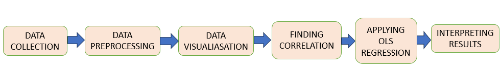
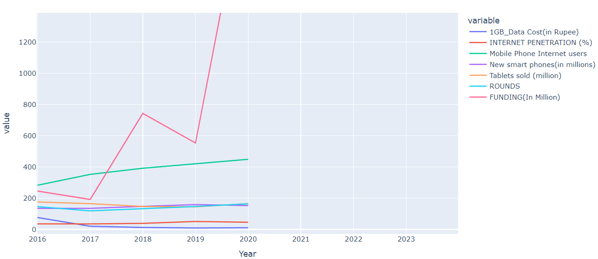

# ED-TECH

This project is an attempt to highlight the growth of Ed Tech industry into what it is now in the form of story telling.

An attempt is made to quantify external factors that possibly helped in the growth.So we look into those as well.

## DATA

    *Data is collected from various news sources and some governement sites.

    *A total of 24 data frames were handled at a time during data preprocessing.

## PACKAGES
    *Pandas 
    *Plotly
    *Seaborn
    *Matplotlib
    *Statsmodel.api

## EDA

A few highlights of the EDA Analysis showing the growing trend of funding in Ed tech Industy.A sign of growing importance.

## ANALYSIS 

Growth of ED TECH is studied in detail along with external factors. A relationship between external factors such as internet 

penetration,mobile internet users,demographic dividend on growth in Ed Tech company funding is drawn using correlation plot.  

## OLS REGRESSION
Using Statsmodel api Ordinary Linear Regression is performed.It is used to draw the relationship between independent(Feature 

Variables) and dependent variable(Funding Rounds).

## RESULTS

Successfully proved that there is a positive relationship.

 

